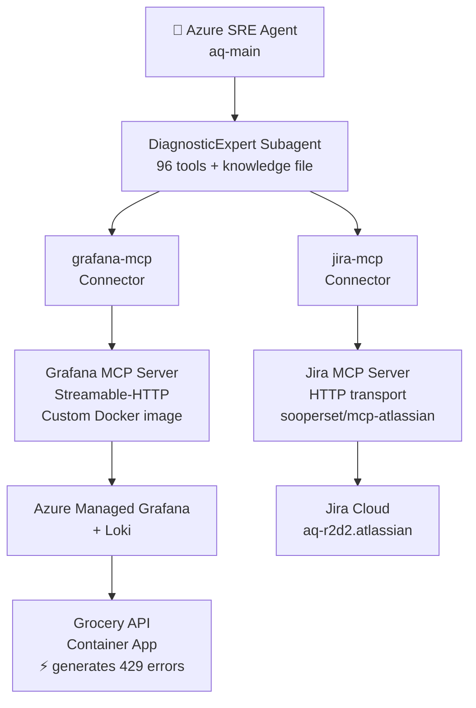
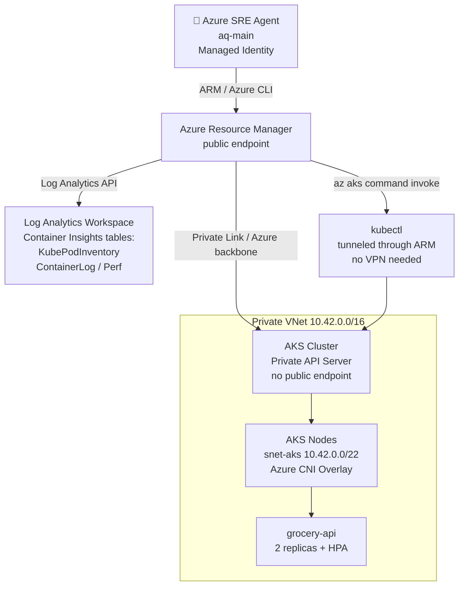

# Azure SRE Agent PoC

> **Attribution:** Based on [grocery-sre-demo](https://github.com/dm-chelupati/grocery-sre-demo) by **Deepthi Chelupati** (Microsoft).

An end-to-end Proof of Concept demonstrating Azure SRE Agent integration with Grafana/Loki and Jira using MCP (Model Context Protocol).

---

## 🚀 Quick Start

1. **Deploy base infrastructure** → `cd grocery-sre-demo && azd up`
2. **Deploy MCP servers** → `./scripts/deploy-mcp-servers.sh`
3. **Configure SRE Agent** → Follow [SETUP_FINDINGS_AND_LESSONS_LEARNED.md](docs/SETUP_FINDINGS_AND_LESSONS_LEARNED.md)

---

## 📁 Repository Structure

```
SRE-AGENT-JAN-2026/
│
├── README.md                              # This file
├── .env.deployment                        # Environment variables (credentials)
├── Dockerfile.grafana-mcp-streamable      # Custom image for Grafana MCP (key fix!)
│
├── docs/                                  # 📚 Documentation
│   ├── SETUP_FINDINGS_AND_LESSONS_LEARNED.md  ⭐ START HERE - Complete setup guide
│   ├── PARTNER_POC_GUIDE.md               # Step-by-step implementation guide
│   ├── DEPLOYMENT_CHECKLIST.md            # Interactive deployment checklist
│   ├── DEPLOYMENT_TIME_TRACKER.md         # Track time & agent performance
│   ├── PHASE4_STATUS.md                   # MCP servers deployment status
│   ├── PHASE5_ACTUAL_SETUP_GUIDE.md       # Azure SRE Agent portal workflow
│   ├── PROJECT_SUMMARY.md                 # Project overview
│   ├── BUG_REPORT_FOR_UPSTREAM.md         # Issues found for upstream repos
│   ├── mcp-endpoints.txt                  # MCP server URLs (quick reference)
│   ├── loki-config.txt                    # Loki configuration
│   └── LINKS_OF_INTEREST.txt              # Useful external links
│
├── scripts/                               # 🔧 Deployment Scripts
│   ├── deploy-loki.sh                     # Deploy Loki to Container Apps
│   ├── deploy-mcp-servers.sh              # Deploy Grafana & Jira MCP servers
│   ├── grafana-mcp-deployment.sh          # Custom Grafana MCP image build
│   ├── jira-deployment.sh                 # Jira MCP deployment
│   ├── setup-status.sh                    # Check deployment status
│   └── test-grafana-mcp-local.sh          # Test MCP server locally
│
├── aks-private-testbed/                   # 🔬 AKS Private VNet Test Bed
│   ├── README.md                          # Full deployment guide
│   ├── LESSONS-LEARNED.md                 # 8 documented quirks from deployment
│   ├── infra/                             # Bicep: VNet, private AKS, ACR, alerts
│   ├── k8s/                               # K8s manifests + crash simulator
│   └── scripts/                           # 01-provision → 05-trigger-incident
│
├── partner-context/                       # 🏢 Partner-Specific Docs
│   └── ZAFIN_CONTEXT.md                   # Zafin requirements & constraints
│
├── grocery-sre-demo/                      # 🛒 Demo Application (submodule)
│   ├── src/api/                           # Node.js API with rate limiting
│   ├── src/web/                           # Web frontend
│   ├── knowledge/loki-queries.md          # LogQL patterns for SRE Agent
│   └── infra/                             # Bicep templates
│
├── scenarios/                             # 📋 Test Scenarios
│   ├── rate-limit-incident.md             # Rate limiting scenario
│   └── service-degradation.md             # Performance degradation scenario
│
└── docs_from_Deepthi Chelupati/           # 📄 Reference Materials
    └── Blog8.docx                         # Original blog post
```

---

## 📖 Documentation Guide

| If you want to... | Read this |
|-------------------|-----------|
| **Understand the full setup & lessons learned** | [SETUP_FINDINGS_AND_LESSONS_LEARNED.md](docs/SETUP_FINDINGS_AND_LESSONS_LEARNED.md) ⭐ |
| **Deploy from scratch** | [PARTNER_POC_GUIDE.md](docs/PARTNER_POC_GUIDE.md) |
| **Track deployment progress** | [DEPLOYMENT_CHECKLIST.md](docs/DEPLOYMENT_CHECKLIST.md) |
| **Understand the Grafana MCP fix** | [Dockerfile.grafana-mcp-streamable](Dockerfile.grafana-mcp-streamable) |
| **Get MCP server URLs** | [mcp-endpoints.txt](docs/mcp-endpoints.txt) |
| **Deploy AKS private VNet test bed** | [aks-private-testbed/README.md](aks-private-testbed/README.md) |
| **Understand SRE Agent + private AKS pattern** | [aks-private-testbed/LESSONS-LEARNED.md](aks-private-testbed/LESSONS-LEARNED.md) |

---

## ⚠️ Key Lesson Learned

**Azure SRE Agent requires Streamable-HTTP transport, NOT SSE!**

Most MCP server images default to SSE mode. We had to build a custom Grafana MCP image:

```dockerfile
FROM grafana/mcp-grafana:latest
ENTRYPOINT ["/app/mcp-grafana","-t","streamable-http","--address","0.0.0.0:8000","--endpoint-path","/mcp"]
```

See [SETUP_FINDINGS_AND_LESSONS_LEARNED.md](docs/SETUP_FINDINGS_AND_LESSONS_LEARNED.md) for the full troubleshooting story.

---

## 🏗️ Architecture

### PoC demo environment (Container Apps + Grafana/Loki + Jira)



### AKS private VNet test bed (validates SRE Agent + private AKS pattern)



---

## 🧪 Test the Demo

```bash
# Trigger rate limit scenario
curl -X POST "https://ca-api-ps64h2ydsavgc.icymeadow-96da5d2b.eastus2.azurecontainerapps.io/api/demo/trigger-rate-limit"

# Then ask the SRE Agent:
# "Investigate rate limit errors in the grocery API"
```

---

## 📞 Resources

- **[Azure SRE Agent Docs](https://learn.microsoft.com/azure/sre-agent)**
- **[MCP Protocol Specification](https://modelcontextprotocol.io)**
- **[Grafana MCP Server](https://github.com/grafana/mcp-grafana)**
- **[sooperset/mcp-atlassian](https://github.com/sooperset/mcp-atlassian)** (Jira MCP)

---

**Version:** 3.0  
**Last Updated:** March 30, 2026  
**Author:** Arturo Quiroga
