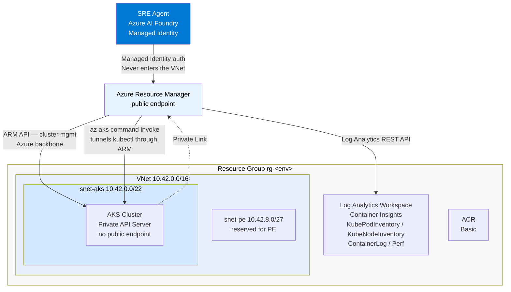
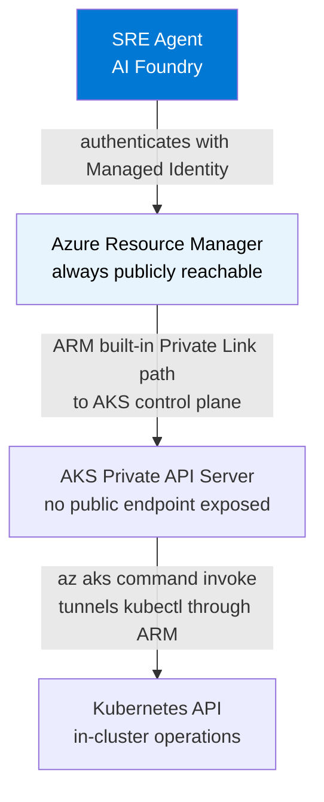

# AKS Private VNet Test Bed — Azure SRE Agent

> **Audience:** Partner Solution Architects, SRE teams
> **Status:** Deployed and validated — March 30, 2026
> **Built by:** Arturo Quiroga (PSA, Microsoft)

This test bed provisions a real private AKS cluster and proves end-to-end that Azure SRE Agent can manage AKS infrastructure in a private VNet — without being inside the network, without VPN, and without a jump box.

---

## Background and motivation

Earlier project documentation stated:

> *"SRE Agent currently does not support AKS Cluster behind private VNET"*

After reviewing the [official Azure SRE Agent docs](https://learn.microsoft.com/en-us/azure/sre-agent/overview) (updated March 27, 2026), this statement is **incorrect**. AKS is listed as a fully supported compute service. The confusion arose from conflating two different access patterns:

| Access pattern | Private AKS support | Notes |
|---|---|---|
| ARM / Azure CLI operations | **Yes — no extra setup** | Scale, upgrade, node pools, `az aks show` all go through Azure Resource Manager, which reaches the private AKS control plane via Azure backbone |
| `kubectl` / in-cluster operations | **Yes — with `az aks command invoke`** | Azure tunnels commands through ARM without requiring the caller to be inside the VNet |
| Direct VNet ingress | Not applicable | SRE Agent never enters your VNet |

This test bed proves the pattern with real infrastructure.

---

## Architecture



### How the SRE Agent reaches a private AKS cluster



The SRE Agent never touches the VNet directly. It operates entirely through Azure's control plane.

---

## Resources deployed

| Resource | SKU / Config | Purpose |
|---|---|---|
| Virtual Network (`10.42.0.0/16`) | 2 subnets | Hosts AKS nodes privately |
| AKS Cluster | `Standard_D2s_v3`, 1–3 nodes, Azure CNI Overlay | Private API server, Container Insights enabled |
| Azure Container Registry | Basic, admin disabled | Stores sample workload image |
| Log Analytics Workspace | PerGB2018, 30-day retention | Container Insights destination for all cluster telemetry |
| User-assigned Managed Identity | Network Contributor on VNet | AKS control-plane identity (best practice: persists across cluster recreations) |
| Alert: Pod Restarts | Log Analytics scheduled query | Fires when any pod in `grocery` namespace restarts > 3 times in 15 min |
| Alert: Node CPU > 80% | Azure Monitor metric alert | Fires after 5 min of sustained high CPU |
| Alert: No Ready Pods | Log Analytics scheduled query | Fires when zero pods are running in `grocery` — potential full outage |
| grocery-api Deployment | 2 replicas, HPA (1–5) | Sample Node.js API; low rate limit makes 429s easy to trigger |

---

## Prerequisites

| Tool | Version checked | Install |
|---|---|---|
| Azure CLI | `az --version` | https://aka.ms/install-azure-cli |
| azd | `azd version` | https://aka.ms/azd |
| Docker Desktop | Running | https://docs.docker.com/get-docker/ |
| Python 3 | `python3 --version` | (used by scripts to parse `az aks command invoke` JSON output) |

Before running any script:

```bash
az login
az account set --subscription "<your-subscription-id>"
azd auth login
```

Confirm you have quota for `Standard_D2s_v3` (minimum 2 vCPUs) in your target region.

---

## Step-by-step deployment

All scripts live in `scripts/` and are numbered in order. Each script is self-contained — it reads azd outputs automatically and does not require manual env var setup beyond the initial `azd env` configuration.

### Step 1 — Initialize azd environment

```bash
cd aks-private-testbed
azd env new sre-aks-test          # choose any environment name
azd env set AZURE_LOCATION eastus2
```

### Step 2 — Provision Azure infrastructure

```bash
./scripts/01-provision.sh
```

**What it does:** Runs `azd provision`, which deploys the full Bicep template:
VNet, private AKS cluster, ACR, Log Analytics workspace, user-assigned managed identity, and all three alert rules.

**Time:** 10–14 minutes. AKS cluster creation dominates.

**Expected output:**

```
(✓) Done: Resource group: rg-sre-aks-test
(✓) Done: Virtual Network: vnet-...
(✓) Done: Container Registry: acrsre...
(✓) Done: Log Analytics workspace: log-...
(✓) Done: AKS Managed Cluster: aks-...
SUCCESS: Your application was provisioned in Azure in X minutes
```

### Step 3 — Build and push the workload image

```bash
./scripts/02-build-push.sh
```

**What it does:** Logs into ACR, builds the `grocery-api` Node.js image for `linux/amd64`, and pushes it. The ACR name is read automatically from azd outputs.

**Note on networking:** AKS nodes pull the image over the outbound load balancer — ACR does not need a private endpoint for this to work.

### Step 4 — Deploy the workload to AKS

```bash
./scripts/03-deploy-workload.sh
```

**What it does:** Substitutes the ACR image reference into `k8s/grocery-api.yaml`, then uses `az aks command invoke` to apply the manifest to the private cluster. No VPN, no Bastion, no kubeconfig on your local machine.

Creates in the `grocery` namespace:
- `Namespace`
- `Deployment` (2 replicas, readiness + liveness probes)
- `Service` (ClusterIP)
- `HorizontalPodAutoscaler` (1–5 replicas, 70% CPU target)

**Expected output:**

```
namespace/grocery created
deployment.apps/grocery-api created
service/grocery-api created
horizontalpodautoscaler.autoscaling/grocery-api-hpa created

NAME                           READY   STATUS    RESTARTS   AGE
grocery-api-567d4987fd-bm5ps   1/1     Running   0          20s
grocery-api-567d4987fd-j9d4n   1/1     Running   0          20s
```

### Step 5 — Grant SRE Agent access

```bash
# Find your SRE Agent's Managed Identity:
# Azure Portal → AI Foundry → your SRE Agent → Settings → Identity → Object (principal) ID

export SRE_AGENT_MI="<object-principal-id>"
./scripts/04-rbac-setup.sh
```

**What it does:** Assigns four RBAC roles to the SRE Agent's managed identity:

| Role | Scope | Enables |
|---|---|---|
| Azure Kubernetes Service Contributor Role | AKS cluster | Scale, upgrade, node pool management via ARM |
| Azure Kubernetes Service Cluster User Role | AKS cluster | `az aks command invoke` (kubectl without VPN) |
| Log Analytics Reader | Log Analytics workspace | KQL queries, Container Insights |
| Reader | Resource group | `az aks show`, `az monitor`, resource enumeration |

---

## Testing the SRE Agent

### Test 1 — ARM-level operations (no kubectl, no VNet access required)

Open the `aq-main` SRE Agent in AI Foundry and try:

```
Show me the status of AKS cluster aks-yiuooxpadbhno in resource group rg-sre-aks-test

List all node pools and their current replica counts

What Azure Monitor alerts are configured on the AKS cluster?

Scale the system node pool to 3 nodes
```

These work entirely through Azure Resource Manager. The SRE Agent never needs to enter the VNet.

### Test 2 — Log Analytics / Container Insights queries

```
Query the Log Analytics workspace for pods in the grocery namespace
that have restarted more than 3 times in the last hour

Show me ContainerLog errors from the grocery-api pod in the last 30 minutes
```

The SRE Agent can generate and execute KQL directly:

```kusto
// Pod restart count by pod — Container Insights
KubePodInventory
| where Namespace == "grocery"
| where isnotempty(PodRestartCount)
| summarize MaxRestarts = max(toint(PodRestartCount)) by Name
| order by MaxRestarts desc
```

```kusto
// Application error logs
ContainerLog
| where TimeGenerated > ago(30m)
| where PodName contains "grocery-api"
| where LogEntry contains "error"
| project TimeGenerated, PodName, LogEntry
```

### Test 3 — kubectl operations via az aks command invoke

```
Using az aks command invoke on cluster aks-yiuooxpadbhno in rg-sre-aks-test,
run: kubectl describe pod -n grocery -l app=grocery-api
```

The SRE Agent can orchestrate `az aks command invoke` calls through a custom runbook — this is the equivalent of kubectl access without requiring network reachability.

### Test 4 — Trigger a real incident

```bash
# Deploy a pod that crashes every 5 seconds → fires pod-restart alert in ~5 min
./scripts/05-trigger-incident.sh

# Watch restarts compound (optional — requires kubeconfig or portal)
# The Log Analytics alert will fire automatically after threshold is reached

# Clean up
./scripts/05-trigger-incident.sh cleanup
```

With the alert firing, ask the SRE Agent:

```
There is a CrashLoopBackOff in the grocery namespace. Investigate and tell me
what is wrong and what the recommended remediation steps are.
```

---

## File structure

```
aks-private-testbed/
├── README.md                        This document
├── LESSONS-LEARNED.md               Troubleshooting log from initial deployment
├── azure.yaml                       azd project config (infra-only, no azd services)
├── scripts/
│   ├── 01-provision.sh              Provision all Azure infrastructure via azd
│   ├── 02-build-push.sh             Build grocery-api image and push to ACR
│   ├── 03-deploy-workload.sh        Deploy K8s manifests via az aks command invoke
│   ├── 04-rbac-setup.sh             Assign RBAC roles to SRE Agent managed identity
│   └── 05-trigger-incident.sh       Deploy/remove CrashLoopBackOff simulator
├── infra/
│   ├── abbreviations.json           Azure resource naming prefixes
│   ├── main.parameters.json         azd parameter file
│   ├── main.bicep                   Subscription-scoped entry point (creates RG)
│   └── resources.bicep              All resources: VNet, AKS, ACR, alerts, RBAC
└── k8s/
    ├── grocery-api.yaml             Healthy 2-replica deployment with HPA
    └── grocery-api-crash.yaml       CrashLoopBackOff simulator (busybox, exits 1)
```

---

## Known quirks and workarounds

See [LESSONS-LEARNED.md](./LESSONS-LEARNED.md) for full detail. Quick summary:

| Issue | Workaround |
|---|---|
| `az aks command invoke` default output format returns "Operation returned invalid status 'OK'" | Always use `--output json` and parse with `python3 -c "..."` |
| `kubectl rollout status` fails through command invoke (streaming watch not supported) | Use `sleep` + `kubectl get pods` instead |
| `az aks command invoke --file` mounts the file as `/mnt/<basename>` — the `--command` must reference only the basename, not the full path | Write temp file to `/tmp/<fixedname>.yaml`; reference just the filename in `--command` |
| `az bicep build` warns on short ACR name when using abbreviation prefix `cr` (2 chars) | Use `acrsre` prefix (6 chars) to satisfy static analysis min-length check |
| Log Analytics scheduled query rules require `timeAggregation` not `timeAggregationMethod` | Fixed in Bicep |
| Evaluation frequency `PT2M` not supported by Log Analytics alert API | Use `PT5M` minimum |
| `KubePodInventory` column is `PodRestartCount` not `RestartCount` | Fixed in KQL |
| Multi-period evaluation (`numberOfEvaluationPeriods > 1`) requires `bin(TimeGenerated, Xm)` in KQL | Added `bin(TimeGenerated, 5m)` to aggregation |

---

## Teardown

```bash
cd aks-private-testbed
azd down --force --purge
```

Deletes the resource group and all contained resources. AKS cluster deletion takes approximately 3 minutes.

---

## Applicability to production private AKS topologies

This test bed validates the pattern for any team running AKS in a private VNet:

| Dimension | This test bed | Production topology |
|---|---|---|
| Compute | AKS, private API server | AKS, private VNET |
| Logs | Log Analytics (Container Insights) | Log Analytics (Container Insights) |
| Metrics | Azure Monitor metric alerts | Azure Monitor |
| Networking | Private VNet, no public AKS endpoint | Same |
| SRE Agent — ARM ops | ✅ Validated | Same pattern applies |
| SRE Agent — kubectl ops | ✅ Validated via `az aks command invoke` | Same pattern applies |
| SRE Agent — KQL queries | ✅ Validated via Log Analytics Reader role | Same pattern applies |

Runbooks and KQL queries validated here transfer directly to production deployments.

---

## Next steps toward production

1. **Replace `grocery` namespace** with your actual namespace structure and label conventions
2. **Update KQL queries** in the SRE Agent knowledge file with your table schemas
3. **Add Application Insights** integration for app-level telemetry (not just infra)
4. **Configure Azure Monitor alert → SRE Agent webhook** for automated incident ingestion
5. **Document your service dependency map** (upstream/downstream services) in the agent knowledge file
6. **Enable Private Endpoints for ACR** if your security policy requires it (nodes would pull via PE instead of outbound LB)
