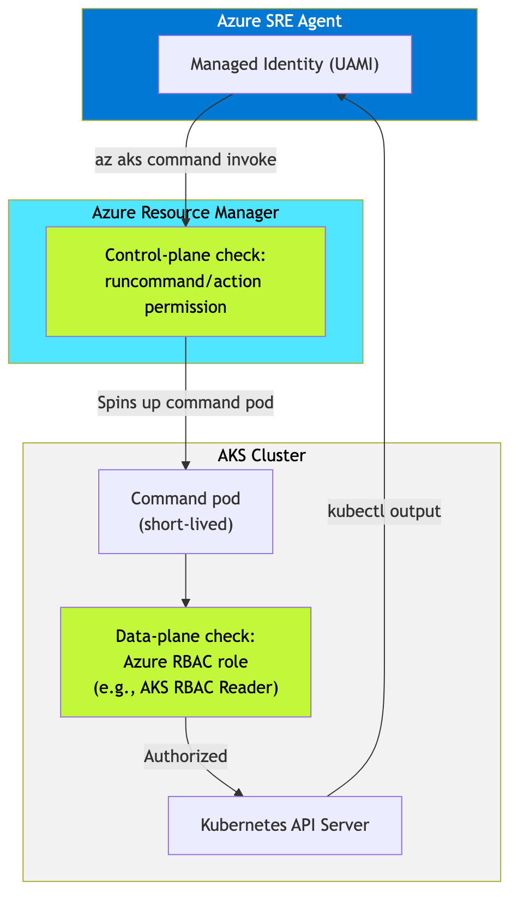
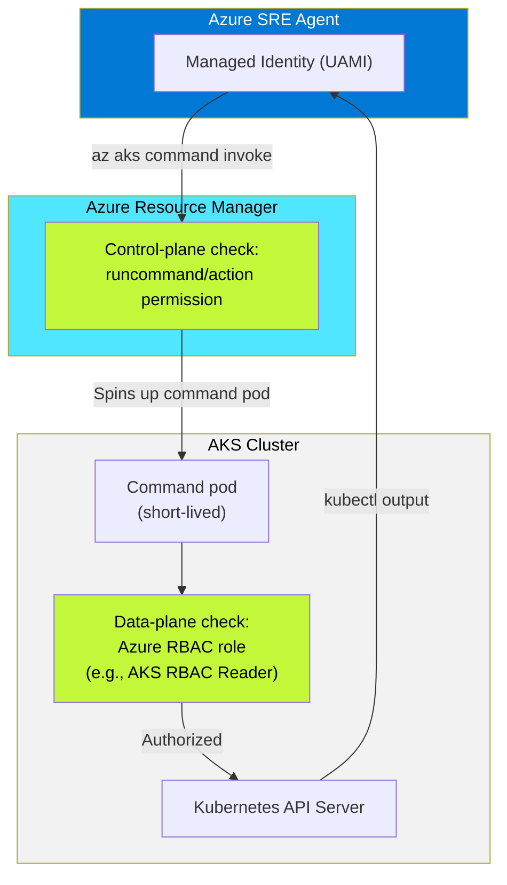

# Making Azure SRE Agent Work on Locked-Down AKS Clusters

*Apps on Azure Blog — Draft v2*
*Author: Arturo Quiroga, Azure AI Services Engineer - Americas Enterprise Partner Solutions (AEPS) - Partner Solutions Architect (PSA)*
*~6 min read*

---

Enterprise SRE teams typically operate in environments where their clusters are completely private, have disabled local accounts, they enforce Azure RBAC for Kubernetes authorization, restrict API server access with authorized IP ranges, and run nodes inside VNet subnets with strict network policies. Diagnosing and mitigating incidents on these clusters — reading pod status, inspecting events, viewing logs, and sometimes applying fixes — requires the SRE Agent to authenticate through multiple layers.

This post covers what we learned deploying Azure SRE Agent against hardened AKS clusters: the dual-layer authorization model, the exact role assignments needed for both read and write operations, and the gotchas that tripped us up along the way. These findings come from reproducing a real enterprise cluster configuration in a testbed environment and systematically resolving every Forbidden error we encountered.


---

## The enterprise AKS security spectrum

Enterprise AKS clusters exist on a spectrum from open to fully locked. The table below shows how each configuration affects SRE Agent access:

| Configuration | API server access | SRE Agent access method | Works? |
|---|---|---|---|
| **Public** (defaults) | Open | Direct or command invoke | Yes |
| **Public + authorized IPs** | IP-restricted | Command invoke (ARM bypass) | Yes |
| **Public + Azure RBAC + no local accounts** | Azure RBAC only | Command invoke + dual-layer roles | Yes (with correct roles) |
| **Private** (private endpoint) | VNet only | Command invoke (ARM bypass) | Yes |
| **Private + Azure RBAC + authorized IPs** | Fully locked | Command invoke + dual-layer roles | Yes (with correct roles) |

*Figure 1: The AKS security spectrum. SRE Agent can reach any cluster through command invoke. The challenge is always authorization, not connectivity.*

The pattern is consistent: `az aks command invoke` through the ARM layer provides access across these configurations. This post focuses on the "with correct roles" part — which is where most teams get stuck.

---

## How SRE Agent reaches a locked-down cluster

Azure SRE Agent doesn't connect directly to the Kubernetes API server. It uses `az aks command invoke`, which routes through the Azure Resource Manager (ARM) layer. ARM spins up a short-lived command pod inside the cluster, runs your kubectl command, and returns the output.

This architecture is significant for two reasons:

1. **Network restrictions on the API server don't block ARM-based access.** Authorized IP ranges, private endpoints, and NSG rules restrict direct API server connections, but ARM API calls follow a separate path. The SRE Agent can reach your cluster through ARM even when direct kubectl access from your workstation is blocked.

2. **Authorization happens at two layers, not one.** ARM checks whether the identity has permission to call `runCommand/action` (control plane). Then the Kubernetes API server checks whether that identity has data-plane access via Azure RBAC roles. Both checks must pass.



> **Figure 2.** Dual-layer authorization flow for SRE Agent on hardened AKS clusters. The ARM layer validates control-plane permissions, then the Kubernetes API server validates data-plane permissions.

<details>
<summary>Mermaid source for Figure 2</summary>



</details>

If either layer is missing, `kubectl` returns `Forbidden` — even for the subscription Owner.

---

## The four roles your SRE Agent needs

Through testing on a cluster configured with `disableLocalAccounts: true` and `enableAzureRBAC: true`, we identified the minimum role set for read-only SRE access:

| # | Role | Type | Scope | Purpose |
|---|---|---|---|---|
| 1 | **Reader** | Built-in | Resource group | ARM metadata reads (`az aks show`, resource listing) |
| 2 | **AKS ReadOnly Command Invoke** | Custom (4 actions) | AKS cluster | Grants `runCommand/action` at the ARM layer |
| 3 | **Log Analytics Reader** | Built-in | Log Analytics workspace | Query container logs via KQL |
| 4 | **AKS RBAC Reader** | Built-in | AKS cluster | Kubernetes data-plane reads (`get pods`, `describe`, `get nodes`) |

The custom role contains exactly four actions — nothing more:

```json
{
  "actions": [
    "Microsoft.ContainerService/managedClusters/read",
    "Microsoft.ContainerService/managedClusters/listClusterUserCredential/action",
    "Microsoft.ContainerService/managedClusters/runcommand/action",
    "Microsoft.ContainerService/managedClusters/commandResults/read"
  ],
  "dataActions": [],
  "notActions": [],
  "notDataActions": []
}
```

*Figure 3: The custom role definition for least-privilege command invoke access.*

This is a least-privilege pattern. The SRE Agent can observe your cluster without permission to modify resources through the assigned roles.

To verify the assignments are in place, query by the agent's managed identity object ID and filter to the cluster's resource group. We use the CLI here rather than the Azure Portal because — as covered in Gotcha 2 below — the Portal's **Check access** panel may show zero assignments even when the roles are correctly configured and working:

```bash
az role assignment list \
  --assignee-object-id $MI_OBJECT_ID --all \
  --query "[?contains(scope, '<your-rg>')].{Role:roleDefinitionName, Scope:scope}" \
  -o table
```


> **Figure 4.** CLI output showing the four role assignments on the SRE Agent's managed identity, scoped to the locked-down AKS resource group: Reader, AKS ReadOnly Command Invoke, Azure Kubernetes Service RBAC Reader, and Log Analytics Reader.

> **Common mistake:** The built-in `Azure Kubernetes Service Cluster User Role` does **not** include `runcommand/action`. It only grants `listClusterUserCredential/action`, which is for `az aks get-credentials` — useless on a cluster with local accounts disabled. If the SRE Agent recommends this role, override it.

---

## Three gotchas we found the hard way

### Gotcha 1: Azure RBAC blocks everyone — including Owner

When `enableAzureRBAC: true` and `disableLocalAccounts: true`, the cluster uses Azure role assignments for all Kubernetes authorization. No Azure RBAC data-plane role means no access — for anyone.

This catches teams off guard because subscription Owners have full ARM access but no Kubernetes data-plane access by default. The first `kubectl get pods` after enabling Azure RBAC returns this:

```
User "admin@contoso.com" cannot get resource "namespaces"
in API group "" in the namespace "default":
User does not have access to the resource in Azure.
Update role assignment to allow access.
```


> **Figure 5.** The Forbidden error returned when Azure RBAC is enabled but no data-plane role is assigned. This error appears even for subscription Owners.

**Fix:** Assign `AKS RBAC Reader` (or `AKS RBAC Cluster Admin` for full access) to the identity at the AKS cluster scope. This applies to each user and managed identity that needs cluster access — including the SRE Agent.

### Gotcha 2: App ID vs Object ID — the identity resolution trap

Azure managed identities have two identifiers:

| Identifier | Example | Where it appears |
|---|---|---|
| App (Client) ID | `5ef3d54d-b401-...` | Token claims, `az login --identity` output |
| SP Object (Principal) ID | `f54ae888-64d7-...` | Portal identity panels, Microsoft Entra ID |

Both identifiers resolve correctly at **runtime** — `az role assignment create --assignee` and `az role assignment list --assignee --all` accept either one and return identical results. The CLI handles the translation transparently.

The trap is the **Azure Portal**. When you open your AKS cluster's **Access control (IAM) > Check access**, select "Managed identity," and pick the SRE Agent identity, the panel shows **Role assignments (0)**. Zero. This is alarming — your agent is working, but the portal says it has no permissions.

What happens: the Check access panel resolves the identity by its display name and matches it to the **principal ID**. If the role assignments were originally created using the **client ID** (which `az role assignment create --assignee <client-id>` does by default), the portal's identity lookup follows a different resolution path and fails to surface the assignments.

The roles are there. The agent works. But the portal says otherwise.

**Verification:** Use the CLI to query by scope instead of by identity — this reliably returns the current assignments:

```bash
# Shows ALL role assignments on the cluster, regardless of how they were created
az role assignment list \
  --scope "/subscriptions/<sub>/resourceGroups/<rg>/providers/Microsoft.ContainerService/managedClusters/<cluster>" \
  -o table
```

> **Tip:** If you want the Portal Check access panel to work correctly, create role assignments using the **principal (object) ID** rather than the client ID. You can find it with `az identity show --name <name> --resource-group <rg> --query principalId -o tsv`.

### Gotcha 3: AKS RBAC Reader doesn't include pod logs

The built-in `AKS RBAC Reader` role covers 30+ data actions — `get pods`, `get nodes`, `get services`, `describe` — but does **not** include:

```
Microsoft.ContainerService/managedClusters/pods/log/read
```

So `kubectl get pods` works, `kubectl describe pod` works, but `kubectl logs <pod>` returns `Forbidden`.

**Fix:** If your SRE Agent needs log access for root cause analysis, either:

- Add `pods/log/read` to the custom role's `dataActions` array, or
- Assign `AKS RBAC Writer` (which includes log reads but also grants create/update — broader than ideal)

---

## Proving it works: command invoke through ARM

To validate that `az aks command invoke` takes a different network path than direct kubectl access, we enabled authorized IP ranges on our test cluster with CIDRs that **explicitly excluded our own IP address**:

```bash
az aks update -g rg-sre-locked -n aks-cluster \
  --api-server-authorized-ip-ranges "52.103.144.0/24,40.97.73.0/25"
```

With our IP blocked from the API server, we deployed a full workload through command invoke:

```bash
az aks command invoke \
  --resource-group rg-sre-locked \
  --name aks-cluster \
  --command "kubectl apply -f deployment.yaml" \
  --file deployment.yaml
```

Result: namespace created, deployment applied, two pods running — all through the ARM layer with no direct API server access.


> **Figure 6.** Successful kubectl output through command invoke with our IP blocked by authorized IP ranges. Command invoke follows the ARM path, which is not affected by API server IP restrictions.

This confirms that `az aks command invoke` through ARM provides a working access path for clusters with IP restrictions, VNet injection, or private endpoint configurations.

---

## Quick-start: minimum viable role setup

For teams setting up SRE Agent on a hardened cluster, here's the exact sequence:

```bash
# 1. Get the SRE Agent's managed identity Object ID
MI_OBJECT_ID=$(az ad sp show --id <agent-app-id> --query id -o tsv)

# 2. Get resource IDs
AKS_ID=$(az aks show -g <rg> -n <cluster> --query id -o tsv)
RG_ID=$(az group show -n <rg> --query id -o tsv)
LA_ID=$(az monitor log-analytics workspace show \
  -g <rg> -n <workspace> --query id -o tsv)

# 3. Assign the four roles
az role assignment create --assignee-object-id $MI_OBJECT_ID \
  --role "Reader" --scope $RG_ID

az role assignment create --assignee-object-id $MI_OBJECT_ID \
  --role "<custom-role-id>" --scope $AKS_ID

az role assignment create --assignee-object-id $MI_OBJECT_ID \
  --role "Log Analytics Reader" --scope $LA_ID

az role assignment create --assignee-object-id $MI_OBJECT_ID \
  --role "Azure Kubernetes Service RBAC Reader" --scope $AKS_ID

# 4. Verify — always use --assignee-object-id, not --assignee
az role assignment list --assignee-object-id $MI_OBJECT_ID --all \
  --query "[].{role:roleDefinitionName, scope:scope}" -o table
```

*Figure 7: Complete role assignment script. Replace placeholders with your resource names and IDs.*

---

## What your SRE Agent can do after setup

With the four-role pattern in place, the SRE Agent can perform the core incident investigation workflow:

| Capability | kubectl command | Status |
|---|---|---|
| List pods, services, deployments | `kubectl get pods -n <ns>` | Supported |
| Describe resources | `kubectl describe pod <name>` | Supported |
| Check node status | `kubectl get nodes` | Supported |
| Read Kubernetes events | `kubectl get events` | Supported |
| Query container logs (KQL) | Via Log Analytics connector | Supported |
| Inspect network policies | `kubectl get networkpolicies` | Supported |
| Read pod logs | `kubectl logs <pod>` | Requires additional `pods/log/read` dataAction |
| Modify resources | — | Blocked by design (read-only) |

This covers incident investigation, health checks, and root cause analysis — the core SRE Agent use cases.

---

## Known limitations

The `az aks command invoke` path works well for AKS clusters because ARM can route commands to the cluster's control plane regardless of network restrictions. However, there are boundaries to be aware of:

**AKS command invoke is control-plane only.** The SRE agent uses ARM to reach the Kubernetes API server, which handles kubectl operations. If a remediation action requires data-plane API calls to resources behind a private endpoint — such as a database, storage account, or internal service running inside the VNet — ARM cannot reach those endpoints. Those operations require the agent itself to have private endpoint connectivity, which is not yet supported.

**Other Azure compute services have different access models.** This post focuses on AKS, but enterprise teams also lock down Azure Container Apps (ACA) and Azure App Service with VNet integration, internal-only ingress, and private endpoints. While ARM-based management operations (restart, configuration, scaling) work similarly, data-plane operations like log streaming, console exec, and Kudu access may be blocked when private endpoints are enabled. We plan to test and document these scenarios in a follow-up post.

**Private endpoint support is on the roadmap.** Until the SRE Agent supports connecting through private endpoints, the workarounds described in this post apply only to control-plane operations routed through ARM. For fully private environments where all resources are behind private endpoints, some agent capabilities will be unavailable.

---

## Feedback and support

We built these findings while deploying Azure SRE Agent in a real enterprise environment with production-grade security constraints. If you encounter additional gotchas or have questions about specific AKS configurations, reach out through:

- [Azure SRE Agent documentation](https://aka.ms/sreagent/newdocs)
- [Azure SRE Agent community discussions](https://techcommunity.microsoft.com/category/azure/blog/appsonazureblog)

---

## Get started

Azure SRE Agent is [generally available](https://aka.ms/sreagent/ga). If you're running hardened AKS clusters, the four-role setup described here gets your agent productive in minutes.

### Resources

- SRE Agent documentation: [aka.ms/sreagent/newdocs](https://aka.ms/sreagent/newdocs)
- SRE Agent GA announcement: [aka.ms/sreagent/ga](https://aka.ms/sreagent/ga)
- Deep Context blog by Deepthi Chelupati: [Azure SRE Agent Now Builds Expertise Like Your Best Engineer](https://techcommunity.microsoft.com/blog/appsonazureblog/azure-sre-agent-now-builds-expertise-like-your-best-engineer-introducing-deep-co/4500754)
- AKS Azure RBAC docs: [Use Azure RBAC for Kubernetes Authorization](https://learn.microsoft.com/en-us/azure/aks/manage-azure-rbac)

Special thanks to [Deepthi Chelupati](https://techcommunity.microsoft.com/users/dchelupati/3031090) for the SRE Agent guidance.

---

*Tags: azure sre agent, azure kubernetes service, cloud native, security, updates*

---

## Appendix: Mermaid diagram source

Use this to render Figure 2 as a PNG for the blog upload:


## Appendix: Screenshot checklist

Before publishing, capture these screenshots:

- [ ] **Figure 4:** Azure Portal > AKS cluster > Access control (IAM) > Role assignments filtered to the SRE Agent managed identity showing all 4 roles
- [ ] **Figure 5:** Terminal output of `kubectl get pods` returning the Forbidden error (before roles are assigned)
- [ ] **Figure 6:** Terminal output of `kubectl get pods -n grocery` showing pods Running (after roles assigned, with authorized IP ranges active)
