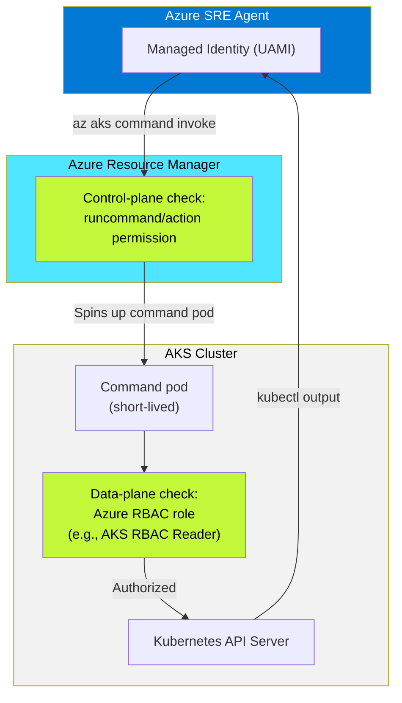

# Making Azure SRE Agent Work on Locked-Down AKS Clusters

*Apps on Azure Blog — Draft v2*
*Author: Arturo Quiroga, Azure AI Services Engineer, Enterprise Partner Solutions*
*~6 min read*

---

Every Azure SRE Agent tutorial shows the same setup: a public AKS cluster, local accounts enabled, `az aks get-credentials`, and you're off. That's not what enterprise clusters look like. In production, your AKS clusters have local accounts disabled, Azure RBAC replaces Kubernetes-native RBAC, authorized IP ranges block API server access, and nodes live inside VNet subnets with strict network policies. When something breaks at 2 AM, your SRE agent needs to run `kubectl` against exactly that cluster — not the one in the tutorial.

This post covers what we learned deploying Azure SRE Agent against hardened AKS clusters: what works, what breaks, and the exact role assignments that make it reliable. These findings come from reproducing a real enterprise cluster configuration in a testbed environment and systematically resolving every `Forbidden` error along the way.

---

## The enterprise AKS security spectrum

Enterprise AKS clusters exist on a spectrum from open to fully locked. The table below shows how each configuration affects SRE Agent access:

| Configuration | API server access | SRE Agent access method | Works? |
|---|---|---|---|
| **Public** (defaults) | Open | Direct or command invoke | Yes |
| **Public + authorized IPs** | IP-restricted | Command invoke (ARM bypass) | Yes |
| **Public + Azure RBAC + no local accounts** | Azure RBAC only | Command invoke + dual-layer roles | Yes (with correct roles) |
| **Private** (private endpoint) | VNet only | Command invoke (ARM bypass) | Yes |
| **Private + Azure RBAC + authorized IPs** | Fully locked | Command invoke + dual-layer roles | Yes (with correct roles) |

*Figure 1: The AKS security spectrum. SRE Agent can reach any cluster through command invoke. The challenge is always authorization, not connectivity.*

The pattern is consistent: `az aks command invoke` through the ARM layer reaches any cluster. This post focuses on the "with correct roles" part — which is where most teams get stuck.

---

## How SRE Agent reaches a locked-down cluster

Azure SRE Agent doesn't connect directly to the Kubernetes API server. It uses `az aks command invoke`, which routes through the Azure Resource Manager (ARM) layer. ARM spins up a short-lived command pod inside the cluster, executes your kubectl command, and returns the output.

This architecture is significant for two reasons:

1. **Network restrictions don't block it.** Authorized IP ranges, private endpoints, NSG rules — none of them affect ARM API calls. The SRE agent can reach your cluster even when your laptop can't.

2. **Authorization happens at two layers, not one.** ARM checks whether the identity has permission to call `runCommand/action` (control plane). Then the Kubernetes API server checks whether that identity has data-plane access via Azure RBAC roles. Both checks must pass.

<!-- FIGURE 2: Architecture diagram (see Mermaid source below) -->
*Figure 2: Dual-layer authorization flow for SRE Agent on hardened AKS clusters. The ARM layer validates control-plane permissions, then the Kubernetes API server validates data-plane permissions.*



If either layer is missing, `kubectl` returns `Forbidden` — even for the subscription Owner.

---

## The four roles your SRE agent needs

Through testing on a cluster configured with `disableLocalAccounts: true` and `enableAzureRBAC: true`, we identified the minimum role set for read-only SRE access:

| # | Role | Type | Scope | Purpose |
|---|---|---|---|---|
| 1 | **Reader** | Built-in | Resource group | ARM metadata reads (`az aks show`, resource listing) |
| 2 | **AKS ReadOnly Command Invoke** | Custom (4 actions) | AKS cluster | Grants `runCommand/action` at the ARM layer |
| 3 | **Log Analytics Reader** | Built-in | Log Analytics workspace | Query container logs via KQL |
| 4 | **AKS RBAC Reader** | Built-in | AKS cluster | Kubernetes data-plane reads (`get pods`, `describe`, `get nodes`) |

The custom role contains exactly four actions — nothing more:

```json
{
  "actions": [
    "Microsoft.ContainerService/managedClusters/read",
    "Microsoft.ContainerService/managedClusters/listClusterUserCredential/action",
    "Microsoft.ContainerService/managedClusters/runcommand/action",
    "Microsoft.ContainerService/managedClusters/commandResults/read"
  ],
  "dataActions": [],
  "notActions": [],
  "notDataActions": []
}
```

*Figure 3: The custom role definition for least-privilege command invoke access.*

This is a least-privilege pattern. The SRE agent can observe your cluster without being able to modify anything.

<!-- FIGURE 4: Screenshot placeholder — Azure Portal showing the 4 role assignments on the AKS cluster -->
*Figure 4: Azure Portal showing the four role assignments on the AKS cluster resource. [SCREENSHOT NEEDED: Portal > AKS > IAM > Role assignments filtered to the SRE agent managed identity]*

> **Common mistake:** The built-in `Azure Kubernetes Service Cluster User Role` does **not** include `runcommand/action`. It only grants `listClusterUserCredential/action`, which is for `az aks get-credentials` — useless on a cluster with local accounts disabled. If the SRE agent recommends this role, override it.

---

## Three gotchas we found the hard way

### Gotcha 1: Azure RBAC blocks everyone — including Owner

When `enableAzureRBAC: true` and `disableLocalAccounts: true`, the cluster uses Azure role assignments for all Kubernetes authorization. No Azure RBAC data-plane role means no access — for anyone.

This catches teams off guard because subscription Owners have full ARM access but zero Kubernetes data-plane access by default. The first `kubectl get pods` after enabling Azure RBAC returns this:

```
User "admin@contoso.com" cannot get resource "namespaces"
in API group "" in the namespace "default":
User does not have access to the resource in Azure.
Update role assignment to allow access.
```

<!-- FIGURE 5: Screenshot placeholder — Terminal showing the Forbidden error -->
*Figure 5: The Forbidden error returned when Azure RBAC is enabled but no data-plane role is assigned. This error appears even for subscription Owners. [SCREENSHOT NEEDED: Terminal output of kubectl get pods showing Forbidden]*

**Fix:** Assign `AKS RBAC Reader` (or `AKS RBAC Cluster Admin` for full access) to the identity at the AKS cluster scope. This is required for every user and every managed identity — including the SRE agent.

### Gotcha 2: App ID vs Object ID — the identity resolution trap

Azure managed identities have two identifiers:

| Identifier | Example | Where it appears |
|---|---|---|
| App (Client) ID | `5ef3d54d-b401-...` | Token claims, `az login --identity` output |
| SP Object ID | `f54ae888-64d7-...` | Role assignments, RBAC bindings |

The SRE agent knows its App ID from token introspection. When it runs `az role assignment list --assignee <app-id>`, it gets **zero results** — because `--assignee` on `list` performs exact-match and does not resolve App ID to Object ID. The agent concludes it has no roles and stops investigating.

**Fix:** Use `--assignee-object-id` when querying role assignments:

```bash
# Returns empty — App ID not auto-resolved
az role assignment list --assignee "5ef3d54d-..." --scope $AKS_ID

# Returns all 4 roles correctly
az role assignment list --assignee-object-id "f54ae888-..." --scope $AKS_ID
```

> **Note:** `az role assignment create --assignee` **does** resolve App ID to Object ID automatically. Only `list` has this behavior — an inconsistency in the Azure CLI that trips up both humans and AI agents.

### Gotcha 3: AKS RBAC Reader doesn't include pod logs

The built-in `AKS RBAC Reader` role covers 30+ data actions — `get pods`, `get nodes`, `get services`, `describe` — but does **not** include:

```
Microsoft.ContainerService/managedClusters/pods/log/read
```

So `kubectl get pods` works, `kubectl describe pod` works, but `kubectl logs <pod>` returns `Forbidden`.

**Fix:** If your SRE agent needs log access for root cause analysis, either:

- Add `pods/log/read` to the custom role's `dataActions` array, or
- Assign `AKS RBAC Writer` (which includes log reads but also grants create/update — broader than ideal)

---

## Proving it works: authorized IP ranges bypass

To validate that `az aks command invoke` truly bypasses network restrictions, we enabled authorized IP ranges on our test cluster with CIDRs that **explicitly excluded our own IP address**:

```bash
az aks update -g rg-sre-locked -n aks-cluster \
  --api-server-authorized-ip-ranges "52.103.144.0/24,40.97.73.0/25"
```

With our IP blocked from the API server, we deployed a full workload through command invoke:

```bash
az aks command invoke \
  --resource-group rg-sre-locked \
  --name aks-cluster \
  --command "kubectl apply -f deployment.yaml" \
  --file deployment.yaml
```

Result: namespace created, deployment applied, two pods running — all through the ARM layer with zero direct API server access.

<!-- FIGURE 6: Screenshot placeholder — Terminal showing successful kubectl get pods output -->
*Figure 6: Successful kubectl output through command invoke with our IP blocked by authorized IP ranges. The SRE agent bypasses network restrictions entirely through the ARM layer. [SCREENSHOT NEEDED: Terminal output showing pods Running]*

This confirms that SRE Agent can manage clusters regardless of IP restrictions, VNet injection, or private endpoint configuration.

---

## Quick-start: minimum viable role setup

For teams setting up SRE Agent on a hardened cluster, here's the exact sequence:

```bash
# 1. Get the SRE agent's managed identity Object ID
MI_OBJECT_ID=$(az ad sp show --id <agent-app-id> --query id -o tsv)

# 2. Get resource IDs
AKS_ID=$(az aks show -g <rg> -n <cluster> --query id -o tsv)
RG_ID=$(az group show -n <rg> --query id -o tsv)
LA_ID=$(az monitor log-analytics workspace show \
  -g <rg> -n <workspace> --query id -o tsv)

# 3. Assign the four roles
az role assignment create --assignee-object-id $MI_OBJECT_ID \
  --role "Reader" --scope $RG_ID

az role assignment create --assignee-object-id $MI_OBJECT_ID \
  --role "<custom-role-id>" --scope $AKS_ID

az role assignment create --assignee-object-id $MI_OBJECT_ID \
  --role "Log Analytics Reader" --scope $LA_ID

az role assignment create --assignee-object-id $MI_OBJECT_ID \
  --role "Azure Kubernetes Service RBAC Reader" --scope $AKS_ID

# 4. Verify — always use --assignee-object-id, not --assignee
az role assignment list --assignee-object-id $MI_OBJECT_ID --all \
  --query "[].{role:roleDefinitionName, scope:scope}" -o table
```

*Figure 7: Complete role assignment script. Replace placeholders with your resource names and IDs.*

---

## What your SRE agent can do after setup

With the four-role pattern in place, the SRE agent can perform the core incident investigation workflow:

| Capability | kubectl command | Status |
|---|---|---|
| List pods, services, deployments | `kubectl get pods -n <ns>` | Supported |
| Describe resources | `kubectl describe pod <name>` | Supported |
| Check node status | `kubectl get nodes` | Supported |
| Read Kubernetes events | `kubectl get events` | Supported |
| Query container logs (KQL) | Via Log Analytics connector | Supported |
| Inspect network policies | `kubectl get networkpolicies` | Supported |
| Read pod logs | `kubectl logs <pod>` | Requires additional `pods/log/read` dataAction |
| Modify resources | — | Blocked by design (read-only) |

This covers incident investigation, health checks, and root cause analysis — the core SRE Agent use cases.

---

## Feedback and support

We built these findings while deploying Azure SRE Agent in a real enterprise environment with production-grade security constraints. If you encounter additional gotchas or have questions about specific AKS configurations, reach out through:

- [Azure SRE Agent documentation](https://aka.ms/sreagent/newdocs)
- [Azure SRE Agent community discussions](https://techcommunity.microsoft.com/category/azure/blog/appsonazureblog)

---

## Get started

Azure SRE Agent is [generally available](https://aka.ms/sreagent/ga). If you're running hardened AKS clusters, the four-role setup described here gets your agent productive in minutes.

### Resources

- SRE Agent documentation: [aka.ms/sreagent/newdocs](https://aka.ms/sreagent/newdocs)
- SRE Agent GA announcement: [aka.ms/sreagent/ga](https://aka.ms/sreagent/ga)
- Deep Context blog by Deepthi Chelupati: [Azure SRE Agent Now Builds Expertise Like Your Best Engineer](https://techcommunity.microsoft.com/blog/appsonazureblog/azure-sre-agent-now-builds-expertise-like-your-best-engineer-introducing-deep-co/4500754)
- AKS Azure RBAC docs: [Use Azure RBAC for Kubernetes Authorization](https://learn.microsoft.com/en-us/azure/aks/manage-azure-rbac)

Special thanks to [Deepthi Chelupati](https://techcommunity.microsoft.com/users/dchelupati/3031090) for the SRE Agent blog series and guidance, and to the Zafin SRE team for sharing their production cluster configuration, which made these findings possible.

---

*Tags: azure sre agent, azure kubernetes service, cloud native, security, updates*

---

## Appendix: Mermaid diagram source

Use this to render Figure 2 as a PNG for the blog upload:


## Appendix: Screenshot checklist

Before publishing, capture these screenshots:

- [ ] **Figure 4:** Azure Portal > AKS cluster > Access control (IAM) > Role assignments filtered to the SRE agent managed identity showing all 4 roles
- [ ] **Figure 5:** Terminal output of `kubectl get pods` returning the Forbidden error (before roles are assigned)
- [ ] **Figure 6:** Terminal output of `kubectl get pods -n grocery` showing pods Running (after roles assigned, with authorized IP ranges active)
