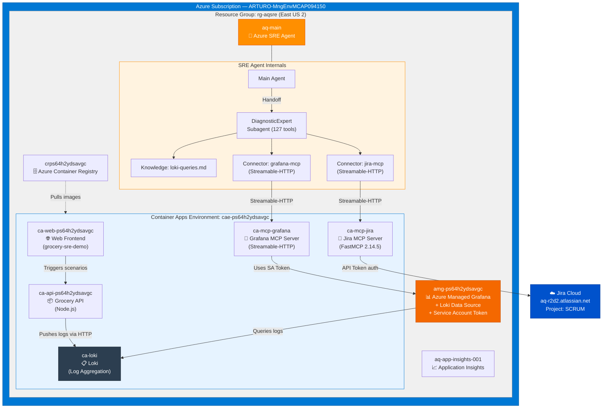

## Architecture Diagram

```mermaid
graph TB
    subgraph AZURE["Azure Subscription — ARTURO-MngEnvMCAP094150"]
        subgraph RG["Resource Group: rg-aqsre (East US 2)"]
            subgraph CAE["Container Apps Environment: cae-ps64h2ydsavgc"]
                WEB["ca-web-ps64h2ydsavgc\n🌐 Web Frontend\n(grocery-sre-demo)"]
                API["ca-api-ps64h2ydsavgc\n📦 Grocery API\n(Node.js)"]
                LOKI["ca-loki\n📋 Loki\n(Log Aggregation)"]
                MCPG["ca-mcp-grafana\n🔌 Grafana MCP Server\n(Streamable-HTTP)"]
                MCPJ["ca-mcp-jira\n🔌 Jira MCP Server\n(FastMCP 2.14.5)"]
            end
            ACR["crps64h2ydsavgc\n🗄️ Azure Container Registry"]
            GRAFANA["amg-ps64h2ydsavgc\n📊 Azure Managed Grafana\n+ Loki Data Source\n+ Service Account Token"]
            SRE["aq-main\n🤖 Azure SRE Agent"]
            subgraph SREINNER["SRE Agent Internals"]
                MAIN["Main Agent"]
                DIAG["DiagnosticExpert\nSubagent (127 tools)"]
                KNOW["Knowledge: loki-queries.md"]
                CONN1["Connector: grafana-mcp\n(Streamable-HTTP)"]
                CONN2["Connector: jira-mcp\n(Streamable-HTTP)"]
            end
            APPINS["aq-app-insights-001\n📈 Application Insights"]
        end
    end

    JIRA["☁️ Jira Cloud\naq-r2d2.atlassian.net\nProject: SCRUM"]

    WEB -->|"Triggers scenarios"| API
    API -->|"Pushes logs via HTTP"| LOKI
    GRAFANA -->|"Queries logs"| LOKI
    MCPG -->|"Uses SA Token"| GRAFANA
    MCPJ -->|"API Token auth"| JIRA
    ACR -.->|"Pulls images"| CAE

    MAIN -->|"Handoff"| DIAG
    DIAG --> KNOW
    DIAG --> CONN1
    DIAG --> CONN2
    CONN1 -->|"Streamable-HTTP"| MCPG
    CONN2 -->|"Streamable-HTTP"| MCPJ
    SRE --- SREINNER

    style AZURE fill:#0078d4,color:#fff,stroke:#005a9e
    style RG fill:#f0f0f0,color:#333,stroke:#999
    style CAE fill:#e6f3ff,color:#333,stroke:#0078d4
    style SREINNER fill:#fff3e0,color:#333,stroke:#ff8f00
    style JIRA fill:#0052cc,color:#fff,stroke:#003d99
    style SRE fill:#ff8f00,color:#fff,stroke:#e65100
    style GRAFANA fill:#f46800,color:#fff,stroke:#c45000
    style LOKI fill:#2c3e50,color:#fff,stroke:#1a252f
```
