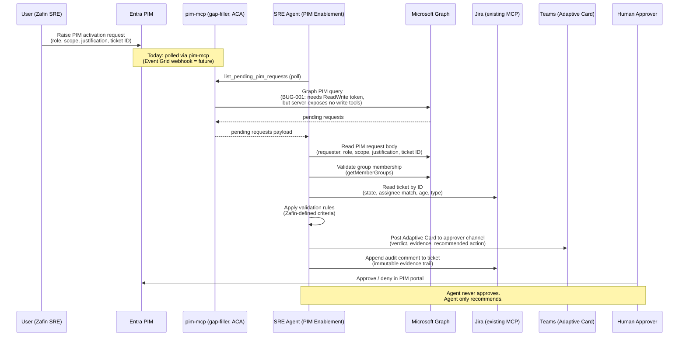

# PIM Enablement — Architecture Sketch

**Use case (per Poornika's writeup, May 1):** Agent assists a human approver
on Privileged Identity Management (PIM) requests. Agent **validates** the
request and **recommends** approve / deny — a human still approves. Hard
human-in-loop boundary; mandatory for banking compliance.

**Status / target:** Top priority · End of June 2026
**Volume target:** 2,000–3,000 tickets/day · 5–10% automation by end of Q2,
25% by end of Q3

---

## May 5 status — what's already built

Since the May 1 writeup, the testbed has moved from concept to a working
end-to-end loop. Bring this context into the meeting:

- ✅ **Gap-filler `pim-mcp` server live** at `ca-pimtest-pimmcp.<region>.azurecontainerapps.io`
  (image `0.2.4`, HTTP 200 verified). Exposes `list_pending_pim_requests`
  read-only tool. Built because the MS-hosted Enterprise MCP hits **BUG-001**
  (read calls require `ReadWrite.Directory` token at runtime — see
  `pim-enablement-testbed/UPSTREAM_BUGS.md`).
- ✅ **Three PowerShell helper scripts** for reproducible demo setup:
  `assign-pim-eligibility.ps1`, `configure-pim-approval.ps1`,
  `trigger-pim-activation.ps1`. Three-identity runbook in
  `pim-enablement-testbed/scripts/REPRODUCE.md`.
- ✅ **Trigger model decision (interim):** polling via
  `pim-mcp.list_pending_pim_requests`. Event Grid webhook still TBD for prod scale.
- 🟡 **Open:** Teams output mechanism, Zafin-owned validation rule table,
  Foundry SRE-agent connector wiring.

> Practical caveat to flag in the meeting: newly granted Graph permissions
> can take **5–60+ minutes** to propagate. Plan setup steps with this lag
> built in.

---

## End-to-end flow



---

## Integration points

| # | Integration | What we read / write | API / connector | Status |
|---|---|---|---|---|
| 1 | **Entra PIM trigger** | Pending PIM activation requests | `pim-mcp.list_pending_pim_requests` (poll, today) → Event Grid webhook (future) | ✅ **Polling live (May 5)**; webhook = V2 |
| 2 | **PIM request details** | requester, role, scope, justification, ticket ID | Microsoft Graph PIM API (via `pim-mcp`) | ✅ Live; **see BUG-001** (runtime needs `ReadWrite.Directory` token) |
| 3 | **Group membership check** | "Is requester in the right group for this role?" | Microsoft Graph `directoryObjects/getMemberGroups` | Standard Graph (read scope) |
| 4 | **Jira ticket validation** | ticket state, assignee, age, type, link to PIM | Existing Jira MCP (Jan PoC) | ✅ Available |
| 5 | **Validation rules engine** | Zafin-defined criteria (deterministic) | Local logic in agent | **Criteria undefined — Zafin owns** |
| 6 | **Teams output** | Adaptive Card with verdict + evidence | Microsoft Graph `chats/messages` OR Teams incoming webhook | **Gap — pick mechanism** |
| 7 | **Audit trail** | Append agent's reasoning + verdict to ticket | Existing Jira MCP | ✅ Available |
| 8 | **MS-hosted Enterprise MCP** | (future) Replace gap-filler when BUG-001 fixed | `https://mcp.svc.cloud.microsoft/enterprise` (OAuth) | 🟡 Blocked by BUG-001 — gap-filler in place |

---

## Identity model

**Behaviorally read-only end-to-end** — no write actions on Azure resources,
no PIM approvals from the agent. Token scope is wider than ideal due to
BUG-001; the compensating control is that the gap-filler server registers
**no write tools**.

| Permission | Granted to | Why |
|---|---|---|
| `RoleEligibilitySchedule.Read.Directory` (Graph) | `pim-mcp` MI | Read PIM eligibility (kept for future fix) |
| `RoleAssignmentSchedule.ReadWrite.Directory` (Graph) | `pim-mcp` MI | **Required by BUG-001** to read pending requests at runtime |
| `GroupMember.Read.All` (Graph) | Agent MI | Validate group membership |
| Jira read + comment (existing MCP) | Agent MI | Ticket validation + audit append |
| `ChannelMessage.Send` (Graph) OR webhook URL | Agent MI | Post Adaptive Card |

**Why this is still safe to ship for banking compliance:**

- `pim-mcp` server **exposes no write tools** — only `list_pending_pim_requests`.
  The MI holds a `ReadWrite` Graph token but the agent has no surface to call
  a write operation through it. (Documented in `pim-enablement-testbed/agent/knowledge.md`.)
- Agent never holds `Approve` permission on PIM
- Every recommendation produces an **immutable Jira audit comment** with the
  agent's reasoning, evidence collected, and verdict
- Final approval action stays in the PIM portal where it's already audited
- Path to true least-privilege: when MS fixes BUG-001, drop the `ReadWrite`
  scope and run on `Read.Directory` only — no agent code changes required

---

## Adaptive Card output spec (proposed)

Posted to the approver Teams channel. Structure:

```text
┌─────────────────────────────────────────────────────────────┐
│ 🔐  PIM Activation Request — Recommendation                 │
├─────────────────────────────────────────────────────────────┤
│ Requester:   Zoya Abou-Jaish (zoya.aboujaish@zafin.com)    │
│ Role:        Contributor                                    │
│ Scope:       /subscriptions/…/rg-prod-eu2                  │
│ Justification: "Investigating P1 incident INC-12345"       │
│ Ticket:      INC-12345 → [link]                            │
├─────────────────────────────────────────────────────────────┤
│ Validation                                                  │
│   ✅ Ticket exists and is open                              │
│   ✅ Ticket created < 24h ago                               │
│   ✅ Requester is assigned to the ticket                    │
│   ✅ Requester is a member of group "SRE-Prod-Approvers"    │
│   ✅ Role + scope match Zafin's allow-list for this group   │
├─────────────────────────────────────────────────────────────┤
│ Verdict: ✅ ELIGIBLE FOR APPROVAL                           │
│ Confidence: High                                            │
│ Recommended action: Approve                                 │
├─────────────────────────────────────────────────────────────┤
│ [ Open in PIM Portal ]   [ View Ticket ]   [ View Evidence ]│
└─────────────────────────────────────────────────────────────┘
```

**Key design choices:**

1. **No "Approve" button on the card** — forces the human to act in the PIM
   portal. Removes any possibility of the agent closing the loop.
2. **Validation list is itemized** — gives the approver the exact evidence
   they need without re-doing the check.
3. **Confidence label** (High / Medium / Low) — when any check fails or
   policy is ambiguous, drop confidence and recommend "Review manually."

---

## Validation rule examples (to be confirmed with Zafin)

These are **placeholders** — Zafin owns the actual criteria. Bring this list
to the customer session as a starting structure to fill in.

| Rule | Example threshold |
|---|---|
| Ticket must exist and be open | state ∈ {Open, In Progress, Investigating} |
| Ticket must be recent | created within last 24h |
| Requester ↔ ticket match | requester is assignee OR reporter |
| Group membership | requester ∈ allow-listed group for the requested role |
| Role / scope allow-list | (group, role, scope) tuple is in Zafin's policy table |
| Activation duration | requested duration ≤ max for role tier |
| Recent activations | requester hasn't activated this role > N times in last 7 days |

---

## Open questions for the internal meeting

1. **Trigger model for V2:** Polling via `pim-mcp` works for the demo and
   single-digit ticket volume. At 2–3K tickets/day, do we move to Event Grid
   webhook from PIM, or stay with tighter polling intervals?
2. **Teams output:** Graph `chats/messages` (per-user identity) or channel
   incoming webhook (simpler, but no user attribution)?
3. **Validation criteria source:** Confirm Zafin owns the rule table; agent
   just executes.
4. **Audit format:** Is a Jira comment sufficient, or do we also need an
   immutable log (Storage append blob, Log Analytics custom table)?
5. **BUG-001 timeline:** Any internal contact for the MS-hosted Enterprise
   MCP team to track when read calls will stop requiring a `ReadWrite` token?
   Determines when we can retire the gap-filler.
6. **Foundry connector wiring:** Who owns connecting `pim-mcp` (SSE at `/sse`)
   and the Enterprise MCP into the SRE agent in Foundry?

---

## Risks for the end-of-June milestone

| Risk | Severity | Mitigation |
|---|---|---|
| ~~PIM trigger / webhook integration is new ground~~ | ~~High~~ → **Low** | ✅ Resolved May 5 — polling via `pim-mcp` live; Event Grid deferred to V2 |
| Teams output mechanism not yet picked | Medium | Decide in next internal meeting |
| Validation criteria not yet defined by Zafin | Medium | Ship with placeholder rules + clear "configurable" interface |
| 2-3K tickets/day load test not planned | Low (V1) | Demo at single-digit ticket volume; load test in V2 |
| **BUG-001** in MS-hosted Enterprise MCP | Medium | Gap-filler `pim-mcp` shipped; tracked in `UPSTREAM_BUGS.md`; retire once upstream fix lands |
| **Graph permission propagation lag (5–60+ min)** | Low (operational) | Document in runbook; build buffer into setup steps and demo prep |

---

## What changes if PIM Enablement also has to fit alongside Self-Healing

Both are flagged "Top priority — End of June." They can't both land
end-of-June if the team is split on two new builds. Recommend sequencing:

- **PIM Enablement → mid-June** (lower risk, all read-only, no allowlist
  negotiation)
- **Ops Automation V1 demo → end-of-June** (Lane A only — ticket resolution
  for 2-3 ticket categories)

This makes PIM the de-risking pilot and gives Self-Healing more room to
land its harder design decisions.
