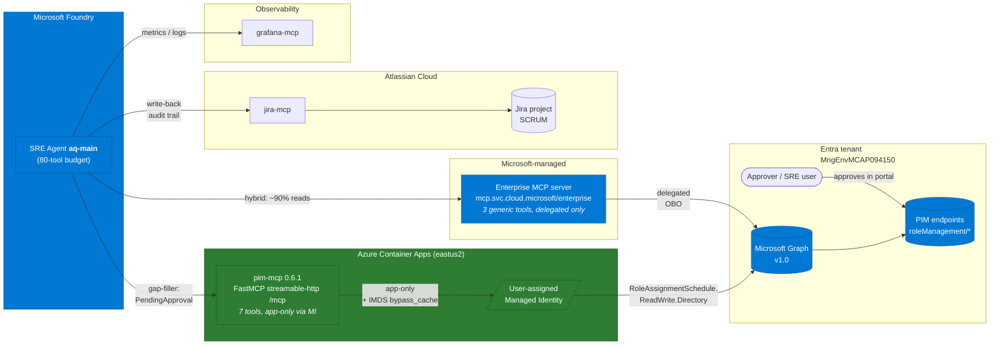
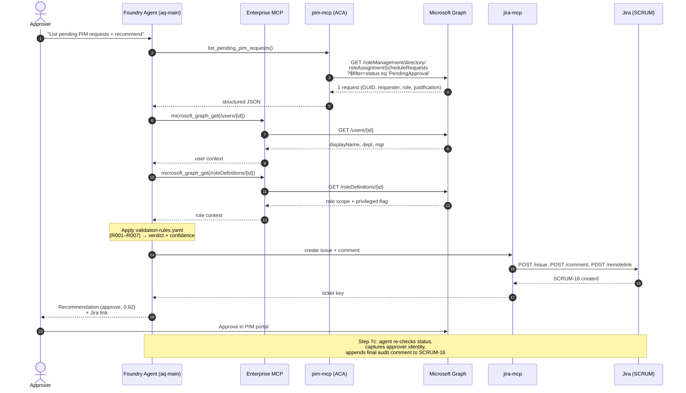
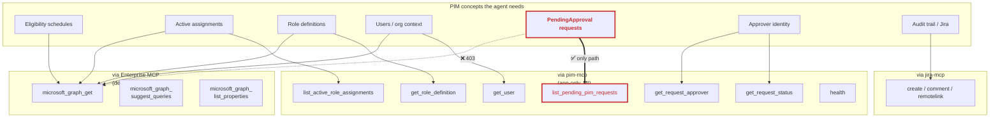
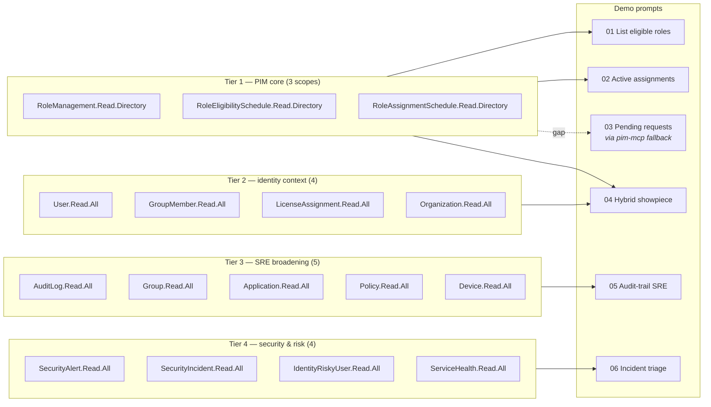
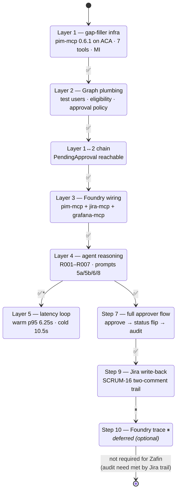

# Architecture diagrams — PIM Enablement testbed

> Visual companion to [`README.md`](../README.md). All diagrams reflect state as of **2026-05-08** (v0.6.1, Layers 1–5 green, Step 9 green, Step 10 deferred).

Diagrams in this file:

1. [System context — hybrid MCP topology](#1-system-context--hybrid-mcp-topology)
2. [Runtime request flow — agent reasoning loop](#2-runtime-request-flow--agent-reasoning-loop)
3. [Tool surface — Enterprise MCP vs `pim-mcp` coverage](#3-tool-surface--enterprise-mcp-vs-pim-mcp-coverage)
4. [VS Code partner-enablement demo — scope tiers](#4-vs-code-partner-enablement-demo--scope-tiers)
5. [Repository layout](#5-repository-layout)
6. [Validation status — by layer](#6-validation-status--by-layer)

---

## 1. System context — hybrid MCP topology

How the SRE agent talks to Microsoft Graph, where each MCP server fits, and which auth model each leg uses.

**Read it as:** Microsoft-blue boxes are managed for us; green boxes are what we own and operate; the red `pim-mcp` exists *only* because the `roleAssignmentScheduleRequests` endpoint requires `ReadWrite` delegated permission that Enterprise MCP doesn't publish in preview ([UPSTREAM_BUGS.md BUG-001](UPSTREAM_BUGS.md)).

---

## 2. Runtime request flow — agent reasoning loop

End-to-end of the showpiece scenario: *"Are there any pending PIM requests right now? If so, recommend approve / deny and write the audit trail."*

---

## 3. Tool surface — Enterprise MCP vs `pim-mcp` coverage

Where each PIM concept is reachable from. This is the picture that justifies the hybrid design.

**Legend:** dotted red = blocked by upstream gap; thick green-routed arrow = the only working path. Everything else has either Enterprise MCP coverage, redundant `pim-mcp` coverage, or both.

---

## 4. VS Code partner-enablement demo — scope tiers

How [`enterprise-mcp-client-demo/`](../enterprise-mcp-client-demo/) layers MCP client scopes from "PIM read-only" up to "security-aware SRE". Each tier is opt-in via `grant-vscode-mcp-scopes.ps1 -Tier 1,2,3,4`.

---

## 5. Repository layout

The pieces that make up the testbed and how they relate.

```mermaid
flowchart TB
    Root["pim-enablement-testbed/"]
    Root --> RM[README.md<br/><i>top-level status</i>]
    Root --> Plan[test-plan-May-5-2026.md]
    Root --> Res[test-results-May-5-2026.md]

    Root --> MCPS["mcp-servers/<br/>pim-mcp/"]
    MCPS --> SRC[src/server.py<br/><i>FastMCP, 7 tools</i>]
    MCPS --> Df[Dockerfile]

    Root --> Inf["infra/"]
    Inf --> Bicep[pim-mcp-aca.bicep<br/><i>ACA + MI + RBAC</i>]

    Root --> Scripts["scripts/"]
    Scripts --> Trig[trigger-pim-activation.ps1]
    Scripts --> Cfg[configure-pim-approval.ps1]

    Root --> Agent["agent/"]
    Agent --> Rules[validation-rules.yaml<br/><i>R001–R007</i>]

    Root --> Demo["enterprise-mcp-client-demo/"]
    Demo --> DemoRM[README.md]
    Demo --> Vscode[vscode/mcp.json]
    Demo --> DemoScripts[scripts/<br/>discover · grant · verify]
    Demo --> DemoPrompts[prompts/01–06]
    Demo --> Trouble[troubleshooting.md]

    Root --> Docs["docs/"]
    Docs --> EntSetup[enterprise-mcp-setup.md]
    Docs --> ToolsRef[pim-tools-via-enterprise-mcp.md]
    Docs --> Bugs[UPSTREAM_BUGS.md]
    Docs --> Threat[threat-model.md]
    Docs --> DeployRB[deployment-runbook.md]
    Docs --> DemoSc[demo-script.md]
    Docs --> Diag[<b>architecture-diagrams.md</b><br/><i>← you are here</i>]

    classDef here fill:#fff59d,stroke:#f57f17,color:#000
    class Diag here
```

---

## 6. Validation status — by layer

State machine of what's proven, what's deferred, and what's optional.

`✅*` = passes for warm path; cold-start above 5s threshold — mitigation is `min-replicas=1` for the demo.

---

## Maintenance

When updating these diagrams:

- Keep the [README.md](../README.md) `## Current state` table and the [Validation status](#6-validation-status--by-layer) state machine in sync.
- When `pim-mcp` adds or removes a tool, update both the [Tool surface](#3-tool-surface--enterprise-mcp-vs-pim-mcp-coverage) flowchart and the [System context](#1-system-context--hybrid-mcp-topology) tool count.
- New scope tiers go in section 4 and must also be reflected in [`enterprise-mcp-client-demo/scripts/grant-vscode-mcp-scopes.ps1`](../enterprise-mcp-client-demo/scripts/grant-vscode-mcp-scopes.ps1).

Render check: GitHub renders Mermaid natively in markdown; VS Code preview needs the built-in Markdown Preview Mermaid Support (enabled by default in 1.85+).
